# Introdução

Informações básicas do projeto.

* **Projeto:** Carnalivre
* **Repositório GitHub:** https://github.com/ICEI-PUC-Minas-PMGES-TI/pmg-es-2025-1-ti1-2010200-hermes_sentry.git
* **Membros da equipe:**

1. [Davi Martins de Almeida ](https://github.com/davimartins27)
2. [Henrique Pereira Resende Rocha](https://github.com/Rickyzadas)
3. [João Prado Campos](https://github.com/Joao-Prado0)
4. [Lucas Gabriel de Oliveira Franco](https://github.com/lucasfrgabriel)
5. [Luiz Fernando Cunha Maia](https://github.com/LuizMaia-PUC)
6. [Pedro Henrique Nogueira Ferreira](https://github.com/PedroHNFerreira)

A documentação do projeto é estruturada da seguinte forma:

1. Introdução
2. Contexto
3. Product Discovery
4. Product Design
5. Metodologia
6. Solução
7. Referências Bibliográficas

✅ [Documentação de Design Thinking (MIRO)](files/processo-dt.pdf)

# Contexto

O carnaval é um dos símbolos do nosso país, são cinco dias em que o povo brasileiro se extravaza e faz uma das festas mais bonitas e democráticas do mundo. Marcado pelos blocos de carnaval, música boa e clima quente, a festa atrai milhões de brasileiros para as ruas, além de se tornar uma atração para turistas que pretendem conhecer mais da cultura brasileira. Porém, com o enorme número de pessoas que participam da festa, se torna muito difícil para gestão pública gerenciar a folia, e é nessa dificuldade que nasce a maioria dos problemas relacionados ao feriado.

## Problema

Os principais problemas apontados envolvem a falta de segurança no carnaval, como furtos, brigas e assédios, mas há também diversas dúvidas sobre a organização dos blocos de carnaval, das forças de segurança e de saúde, e da infaestrutura da cidade para eventos grandes.

## Objetivos

A finalidade do CarnaLivre é desenvolver um software para solucionar o problema de falta de informações e segurança sobre o carnaval de Belo Horizonte. Com base nisso, o sistema recebe informações sobre os blocos de carnaval, cadastradas pelos próprios organizadores, analisa e classifica essas informações em categorias, e permite que os usuários acessem essas informações. Além disso, o sistema contém uma seção de comentários para que os foliões compartilhem suas experiências e uma aba dedicada a denúncias, para casos mais graves, promovendo um ambiente mais seguro para todos.

## Justificativa

A escolha do tema segurança no carnaval surgiu devido todos os participantes do grupo conhecerem alguém que já passou por experiencias ruins no carnaval. O carnaval de Belo Horizonte cada vez mais vem crescendo, recebendo uma grande quantidade de pessoas de várias cidades vizinhas, mas junto a esse grande número de foliões, também temos problemas como furtos, assédios, brigas e muita desinformação. Muita gente não sabe onde estão os blocos, quais são mais tranquilos ou como pedir ajuda em caso de problemas. Pensando nisso, pensamos em um sistema simples e acessível que reúne informações dos blocos, permite comentários dos foliões, e ainda oferece uma aba para denúncias, ajudando a criar um carnaval mais seguro, participativo e consciente para todo mundo.

## Público-Alvo

O CarnaLivre é voltado principalmente para dois públicos: os foliões, que buscam informações seguras e atualizadas sobre os blocos de carnaval, além de um canal para compartilhar experiências e fazer denúncias; e os organizadores de blocos, que precisam de uma plataforma prática para divulgar seus eventos, atrair mais público e colaborar com a organização e segurança da festa. Ambos se beneficiam da proposta do sistema, já que ele promove uma comunicação mais clara, fortalece a confiança entre participantes e ajuda a tornar o carnaval mais seguro e bem estruturado para todos.

# Product Discovery

## Etapa de Entendimento

* **Matriz CSD**: 
* **Mapa de stakeholders**: 
* **Entrevistas qualitativas**: 

* **Highlights de pesquisa**: 


## Etapa de Definição

### Personas

| Persona 1 | Persona 2 |
| ------- | ------- |
|  |  |

| Persona 3 | Persona 4 |
| --------- | --------- |
|  |  |

| Persona 5 | Persona 6 |
| --------- | --------- |
|  |  |

# Product Design

Nesse momento, vamos transformar os insights e validações obtidos em soluções tangíveis e utilizáveis. Essa fase envolve a definição de uma proposta de valor, detalhando a prioridade de cada ideia e a consequente criação de wireframes, mockups e protótipos de alta fidelidade, que detalham a interface e a experiência do usuário.

## Histórias de Usuários

Com base na análise das personas foram identificadas as seguintes histórias de usuários:

| EU COMO...`PERSONA` | QUERO/PRECISO ...`FUNCIONALIDADE`        | PARA ...`MOTIVO/VALOR`               |
| --------------------- | ------------------------------------------ | -------------------------------------- |
| Usuário: Folião   | Preciso do sistema de denuncias do site | Me sentir mais amparada e protegida em caso de qualquer problemas |
| Usuário: Folião   | Um mapa interativo (API Google Maps) | Não me perder pela cidade enquanto procuro os blocos |
| Usuário: Folião   | Um sistema de pesquisa de blocos | Encontrar informações sobre blocos |
| Usuário: Folião   | Filtros de pesquisa | Para selecionar blocos que atendem aos meus interesses e gostos |
| Usuário: Folião   | Ver o feedback dos blocos  | Para saber qual é o mais animado |
| Usuário: Representante de bloco   | Cadastro dos blocos | Divulgar informações sobre o bloco que organiza, e aumentar seu alcance |
| Usuário: Folião   | Categoria e Feedback dos blocos | Para conseguir curtir em segurança com a minha família |
| Usuário: Folião   | Preciso saber quais lugares/ruas estarao fechados e abertos durante o carnaval | Me organizar durante o periodo da folia|
| Usuário: Folião   | Criar grupos de usuários com meus amigos | Conseguirmos nos encontrar com maior facilidade nos blocos |

## Proposta de Valor

| 1: Vitoria | 2: Juliana |
| ----- | ------ |
|  |  |

| 3: Guilherme | 4: Marcelo |
| ----- | ------ |
|  |  |

| 5: Maria Jeronima | 6: Pedro |
| ----- | ------ |
|  |  |

## Requisitos

As tabelas que se seguem apresentam os requisitos funcionais e não funcionais que detalham o escopo do projeto.

### Requisitos Funcionais


| ID     | Descrição do Requisito                                   | Prioridade |
| ------ | ---------------------------------------------------------- | ---------- |
| RF-001 | O sistema deve ter integração com a API do Google Maps, assim proporcionando mapas interativos e informativos. | ALTA |
| RF-003 | O sistema deve permitir que organizadores cadastrem blocos, informando nome, localização, público esperado, faixa etária média, estilo musical e anexando imagens. | MÉDIA |
| RF-002 | O sistema deve armazenar as infromações cadastradas pelos organizadores do bloco e organizar elas nos mapas. | ALTA |
| RF-004 | O site deve conter cadastro diferente para organizadores de bloco, deve exigir email, senha, CNPJ da organização (para verificação),captcha. | MÉDIA |
| RF-005 | O sistema deve conter cadastramento dos demais usuários, solicitando email, nome completo, senha e nome de usuário. | ALTA |
| RF-006 | O sistema deve conter espaço para login daqueles que já possuem conta (Email e senha). | BAIXA |
| RF-007 | O sistema deve permitir que usuários avaliem os blocos com notas de uma a cinco estrelas, façam comentários sobre os blocos e compartilhem as páginas de eventos. | MÉDIA |
| RF-008 | O sistema deve permitir que usuários registrem denúncias informando local, crime ocorrido, horário e bloco associado. | ALTA |
| RF-009 | O sistema deve permitir que usuários pesquisem os blocos por nome. A pesquisa deve também incluir filtros de pesquisa, sendo eles: tamanho do bloco, região, horário, estilo musical, faixa etária, avaliação e se acontece no dia da pesquisa. | MÉDIA |
| RF-010 | O sistema deve ser capaz de validar o CNPJ informado no cadastro dos organizadores, verificando se é válido segundo as regras da Receita Federal. | BAIXA |

### Requisitos não Funcionais
| ID      | Descrição do Requisito                                                             | Prioridade |
| ------- | ---------------------------------------------------------------------------------- | ---------- |
| RNF-001 | Desenvolvimento em HTML, CSS e JavaScript.(código organizado e eficiente). | MÉDIA |
| RNF-002 | Páginas devem abrir em menos de 5 segundos. | BAIXA |
| RNF-003 | Alta usabilidade, tendo em vista o diverso público alvo que o sistema vai atender. | BAIXA |
| RNF-004 | O site deve ser responsivo para as diferentes telas. | BAIXA |
| RNF-005 | O sistema deve garantir 99,5% de uptime mensal, monitorado por ferramentas de observabilidade. | ALTA |

## Projeto de Interface

Artefatos relacionados com a interface e a interacão do usuário na proposta de solução.

### Wireframes

Estes são os protótipos de telas do sistema.

| Login | Login Bloco |
| ----- | ------ |
|  |  |

| Cadastro Usuario | Cadastro Bloco |
| ----- | ------ |
|  |  |

| Home | Blocos |
| ----- | ------ |
|  |  |

| Descrição dos blocos | Perfil |
| ----- | ------ |
|  |  |

| Selecionar | Home Bloco |
| ----- | ------ |
|  |  |

| Denuncia | Perfil Bloco |
| ----- | ------ |
|  |  |


### Protótipos de Tela

#### HOME-PAGE

Tela inicial do sistema


##### TELA DE LOGIN

Tela para login e/ou cadastro de usuário.


##### TELA DE CADASTRO: Seleção

Tela para realizar cadastro, solicita ao usuário que informe o tipo de cadastro: bloco ou folião.


##### TELA DE CADASTRO: Cadastro

Tela para realizar cadastro de folião ou bloco, solicita ao usuário as informações necessárias para o cadastro.

| Folião | Bloco |
| ----- | ------ |
|  |  |

##### TELA INICIAL

Tela inicial do sistema, mostra ao usuário informações principais:
- Imangens do bloco, para representantes de bloco
- Mapa para foliões

| Folião | Bloco |
| ------ | ----- |
|  |  |

##### TELA DE CONSULTA DE BLOCOS: Folião

Tela de consulta de blocos, permite que o folião veja todos os blocos cadastrados e, ao selecionar um bloco, veja informações detalhadas sobre ele.

| Consulta de blocos | Bloco selecionado |
| ------ | ----- |
|  |  |

##### TELA DE CONSULTA DE BLOCOS: Organizador

Tela de consulta de blocos, permite que o organizador veja as informações cadastradas de seu bloco e altere essas informações.

|  |
| ------ |
|  |

##### TELA DE DENÚNCIAS

Tela de denúncias, permite que o usuário realize uma denúncia.

|  |  |
| ------ | ----- |
|  |  |

##### TELA DE CONVERSAS

Tela de conversas, permite que o usuário se conecte e converse com outros usuários.

| Folião | Bloco |
| ------ | ----- |
|  |  |

##### TELA DE PERFIL

Tela de perfil, permite que o usuário acesse e altere suas configurações do perfil, como foto, nome de usuário, email.

| Folião | Bloco |
| ------ | ----- |
|  |  |

##### TELA DE INFORMAÇÕES DO BLOCO

Tela de informações do bloco, permite que o organizador acesse e altere as configurações do bloco, como fotos, descrição, estilo musical, etc.

| Informações | Imagens |
| ------ | ----- |
|  |  |

### User Flow

**✳️✳️✳️ adicionar user flow atualizado ✳️✳️✳️**

### Protótipo Interativo

**✳️✳️✳️ COLOQUE AQUI UM IFRAME COM SEU PROTÓTIPO INTERATIVO ✳️✳️✳️**

✅ [Protótipo Interativo (MarvelApp)](https://marvelapp.com/prototype/4hd6091?emb=1&iosapp=false&frameless=false)  ⚠️ EXEMPLO ⚠️

> ⚠️ **APAGUE ESSA PARTE ANTES DE ENTREGAR SEU TRABALHO**
>
> Um protótipo interativo apresenta o projeto de interfaces e permite ao usuário navegar pelas funcionalidades como se estivesse lidando com o software pronto. Utilize as mesmas ferramentas de construção de wireframes para montagem do seu protótipo interativo. Inclua o link para o protótipo interativo do projeto.

# Metodologia

API do Google Maps
API de clima

## Ferramentas

| Ambiente                    | Plataforma | Link de acesso                                     |
| --------------------------- | ---------- | -------------------------------------------------- |
| Processo de Design Thinking | Miro       |  https://miro.com/app/board/uXjVIZ5HaSk=/?share_link_id=934339239127 |
| Repositório de código     | GitHub     | https://github.com/ICEI-PUC-Minas-PMGES-TI/pmg-es-2025-1-ti1-2010200-hermes_sentry |
| Protótipo do site         | Figma      | https://www.figma.com/design/lIcNjqnRvlVUjhwUDng2L3/fluxo-de-telas?node-id=0-1&p=f&t=jGkhIGoeICWzf4sn-0 |
| Hospedagem do site          | Render     | https://site.render.com/XXXXXXX ⚠️ EXEMPLO ⚠️ |
| Protótipo Interativo       | MarvelApp  | https://marvelapp.com/XXXXXXX ⚠️ EXEMPLO ⚠️   |
|                             |            |                                                    |

## Gerenciamento do Projeto

Divisão de papéis no grupo e apresentação da estrutura da ferramenta de controle de tarefas (Kanban).


> ⚠️ **APAGUE ESSA PARTE ANTES DE ENTREGAR SEU TRABALHO**
>
> Nesta parte do documento, você deve apresentar  o processo de trabalho baseado nas metodologias ágeis, a divisão de papéis e tarefas, as ferramentas empregadas e como foi realizada a gestão de configuração do projeto via GitHub.
>
> Coloque detalhes sobre o processo de Design Thinking e a implementação do Framework Scrum seguido pelo grupo. O grupo poderá fazer uso de ferramentas on-line para acompanhar o andamento do projeto, a execução das tarefas e o status de desenvolvimento da solução.
>
> **Orientações**:
>
> - [Sobre Projects - GitHub Docs](https://docs.github.com/pt/issues/planning-and-tracking-with-projects/learning-about-projects/about-projects)
> - [Gestão de projetos com GitHub | balta.io](https://balta.io/blog/gestao-de-projetos-com-github)
> - [(460) GitHub Projects - YouTube](https://www.youtube.com/playlist?list=PLiO7XHcmTsldZR93nkTFmmWbCEVF_8F5H)
> - [11 Passos Essenciais para Implantar Scrum no seu Projeto](https://mindmaster.com.br/scrum-11-passos/)
> - [Scrum em 9 minutos](https://www.youtube.com/watch?v=XfvQWnRgxG0)

# Solução Implementada

Esta seção apresenta todos os detalhes da solução criada no projeto.

## Vídeo do Projeto

O vídeo a seguir traz uma apresentação do problema que a equipe está tratando e a proposta de solução. ⚠️ EXEMPLO ⚠️

[](https://www.youtube.com/embed/70gGoFyGeqQ)

> ⚠️ **APAGUE ESSA PARTE ANTES DE ENTREGAR SEU TRABALHO**
>
> O video de apresentação é voltado para que o público externo possa conhecer a solução. O formato é livre, sendo importante que seja apresentado o problema e a solução numa linguagem descomplicada e direta.
>
> Inclua um link para o vídeo do projeto.

## Funcionalidades

Esta seção apresenta as funcionalidades da solução.Info

##### Funcionalidade 1 - Cadastro de Contatos ⚠️ EXEMPLO ⚠️

Permite a inclusão, leitura, alteração e exclusão de contatos para o sistema

* **Estrutura de dados:** [Contatos](#ti_ed_contatos)
* **Instruções de acesso:**
  * Abra o site e efetue o login
  * Acesse o menu principal e escolha a opção Cadastros
  * Em seguida, escolha a opção Contatos
* **Tela da funcionalidade**:

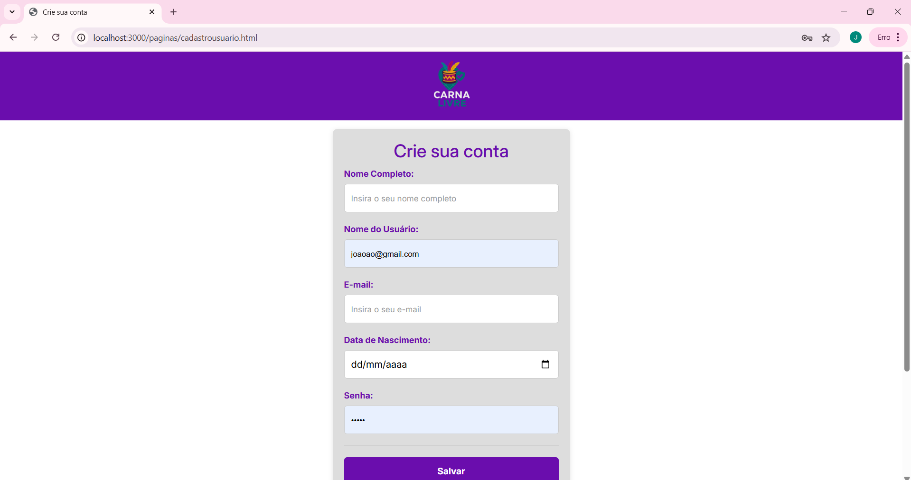

##### Funcionalidade 1 - Cadastro de Contatos ⚠️ EXEMPLO ⚠️

Permite a inclusão, leitura, alteração e exclusão de contatos para o sistema

* **Estrutura de dados:** [Contatos](#ti_ed_contatos)
* **Instruções de acesso:**
  * Abra o site e efetue o login
  * Acesse o menu principal e escolha a opção Cadastros
  * Em seguida, escolha a opção Contatos
* **Tela da funcionalidade**:

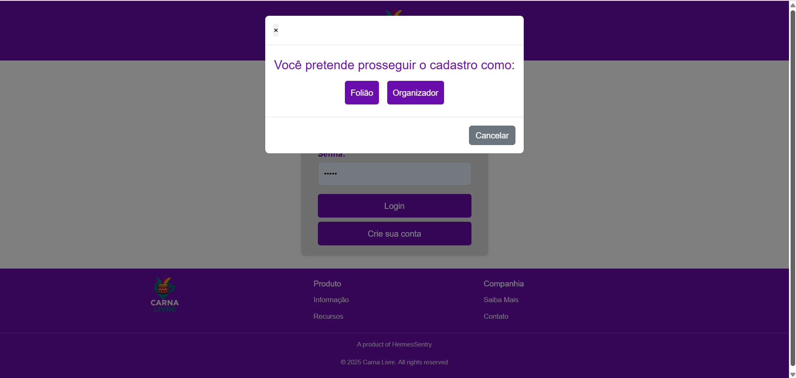

##### Funcionalidade 1 - Cadastro de Contatos ⚠️ EXEMPLO ⚠️

Permite a inclusão, leitura, alteração e exclusão de contatos para o sistema

* **Estrutura de dados:** [Contatos](#ti_ed_contatos)
* **Instruções de acesso:**
  * Abra o site e efetue o login
  * Acesse o menu principal e escolha a opção Cadastros
  * Em seguida, escolha a opção Contatos
* **Tela da funcionalidade**:

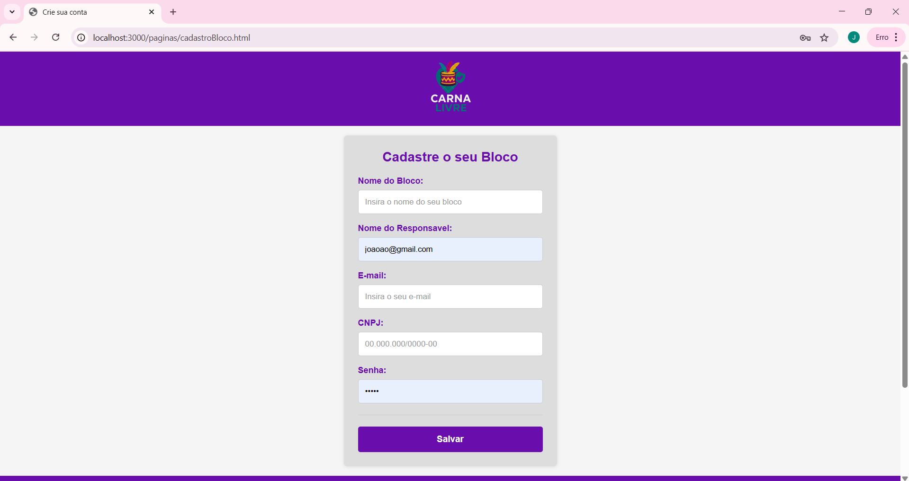

##### Funcionalidade 1 - Cadastro de Contatos ⚠️ EXEMPLO ⚠️

Permite a inclusão, leitura, alteração e exclusão de contatos para o sistema

* **Estrutura de dados:** [Contatos](#ti_ed_contatos)
* **Instruções de acesso:**
  * Abra o site e efetue o login
  * Acesse o menu principal e escolha a opção Cadastros
  * Em seguida, escolha a opção Contatos
* **Tela da funcionalidade**:

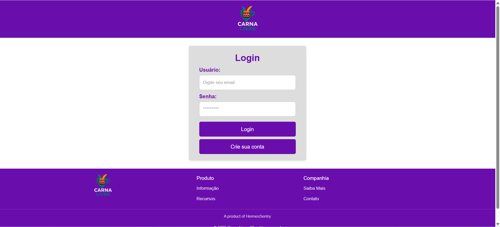

##### Funcionalidade 1 - Cadastro de Contatos ⚠️ EXEMPLO ⚠️

Permite a inclusão, leitura, alteração e exclusão de contatos para o sistema

* **Estrutura de dados:** [Contatos](#ti_ed_contatos)
* **Instruções de acesso:**
  * Abra o site e efetue o login
  * Acesse o menu principal e escolha a opção Cadastros
  * Em seguida, escolha a opção Contatos
* **Tela da funcionalidade**:

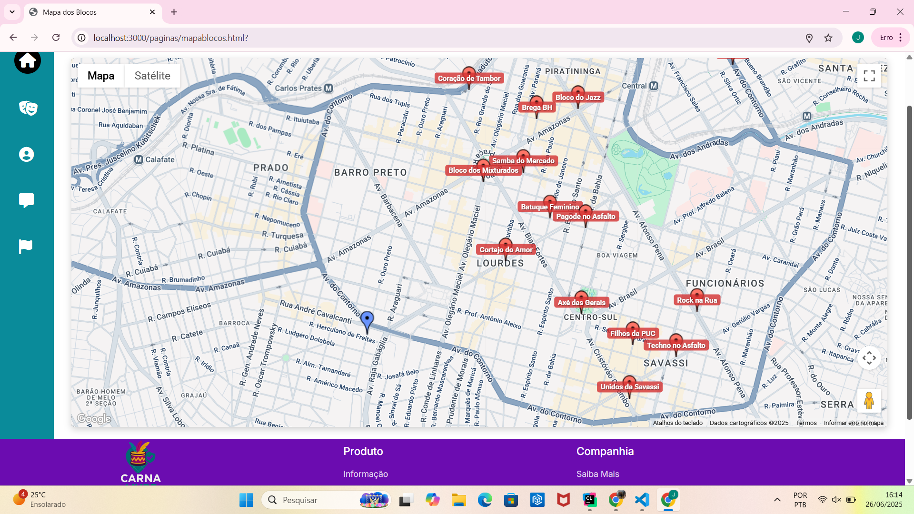

##### Funcionalidade 1 - Cadastro de Contatos ⚠️ EXEMPLO ⚠️

Permite a inclusão, leitura, alteração e exclusão de contatos para o sistema

* **Estrutura de dados:** [Contatos](#ti_ed_contatos)
* **Instruções de acesso:**
  * Abra o site e efetue o login
  * Acesse o menu principal e escolha a opção Cadastros
  * Em seguida, escolha a opção Contatos
* **Tela da funcionalidade**:

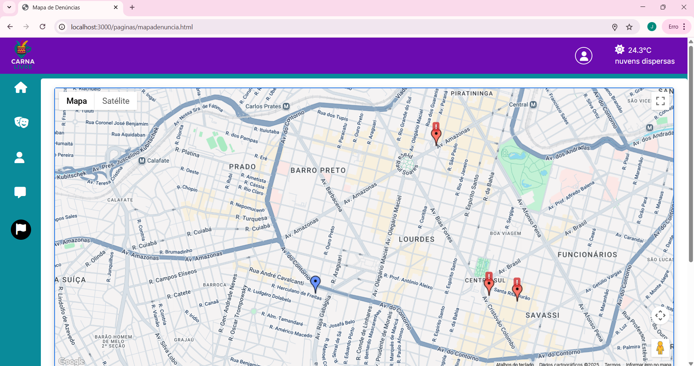

##### Funcionalidade 1 - Cadastro de Contatos ⚠️ EXEMPLO ⚠️

Permite a inclusão, leitura, alteração e exclusão de contatos para o sistema

* **Estrutura de dados:** [Contatos](#ti_ed_contatos)
* **Instruções de acesso:**
  * Abra o site e efetue o login
  * Acesse o menu principal e escolha a opção Cadastros
  * Em seguida, escolha a opção Contatos
* **Tela da funcionalidade**:

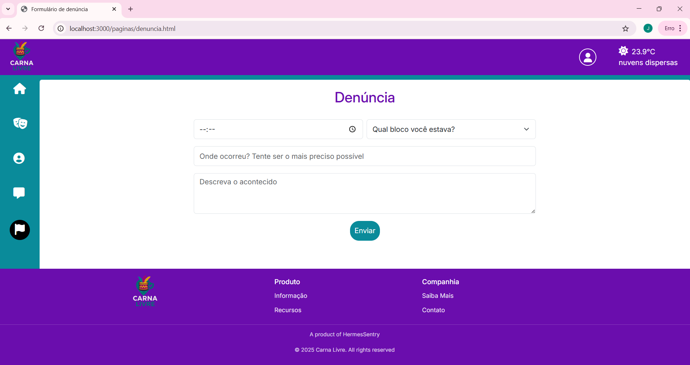

##### Funcionalidade 1 - Cadastro de Contatos ⚠️ EXEMPLO ⚠️

Permite a inclusão, leitura, alteração e exclusão de contatos para o sistema

* **Estrutura de dados:** [Contatos](#ti_ed_contatos)
* **Instruções de acesso:**
  * Abra o site e efetue o login
  * Acesse o menu principal e escolha a opção Cadastros
  * Em seguida, escolha a opção Contatos
* **Tela da funcionalidade**:

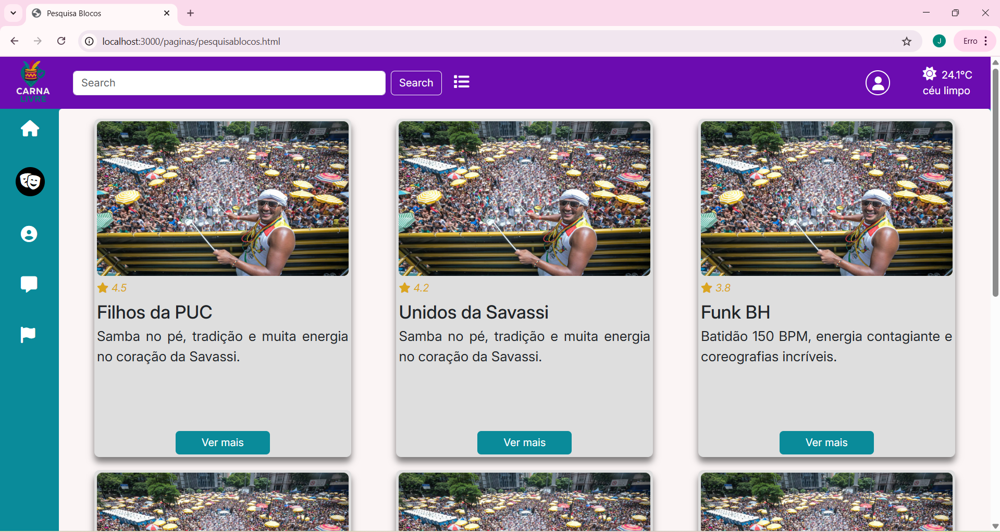

##### Funcionalidade 1 - Cadastro de Contatos ⚠️ EXEMPLO ⚠️

Permite a inclusão, leitura, alteração e exclusão de contatos para o sistema

* **Estrutura de dados:** [Contatos](#ti_ed_contatos)
* **Instruções de acesso:**
  * Abra o site e efetue o login
  * Acesse o menu principal e escolha a opção Cadastros
  * Em seguida, escolha a opção Contatos
* **Tela da funcionalidade**:

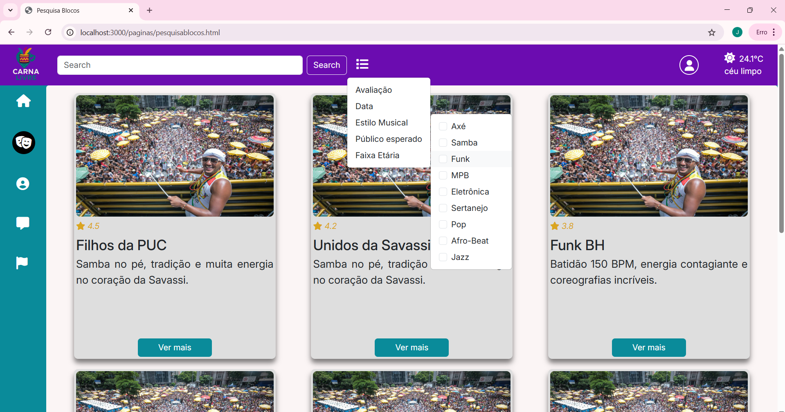

##### Funcionalidade 1 - Cadastro de Contatos ⚠️ EXEMPLO ⚠️

Permite a inclusão, leitura, alteração e exclusão de contatos para o sistema

* **Estrutura de dados:** [Contatos](#ti_ed_contatos)
* **Instruções de acesso:**
  * Abra o site e efetue o login
  * Acesse o menu principal e escolha a opção Cadastros
  * Em seguida, escolha a opção Contatos
* **Tela da funcionalidade**:


##### Funcionalidade 1 - Cadastro de Contatos ⚠️ EXEMPLO ⚠️

Permite a inclusão, leitura, alteração e exclusão de contatos para o sistema

* **Estrutura de dados:** [Contatos](#ti_ed_contatos)
* **Instruções de acesso:**
  * Abra o site e efetue o login
  * Acesse o menu principal e escolha a opção Cadastros
  * Em seguida, escolha a opção Contatos
* **Tela da funcionalidade**:

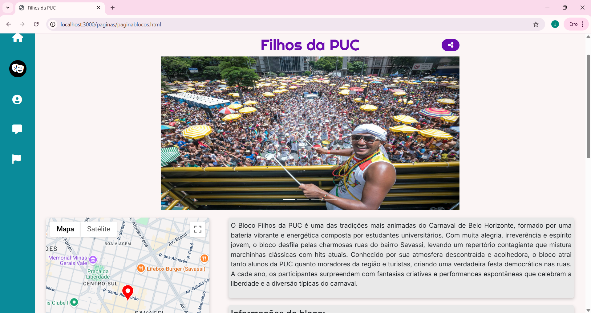

##### Funcionalidade 1 - Cadastro de Contatos ⚠️ EXEMPLO ⚠️

Permite a inclusão, leitura, alteração e exclusão de contatos para o sistema

* **Estrutura de dados:** [Contatos](#ti_ed_contatos)
* **Instruções de acesso:**
  * Abra o site e efetue o login
  * Acesse o menu principal e escolha a opção Cadastros
  * Em seguida, escolha a opção Contatos
* **Tela da funcionalidade**:

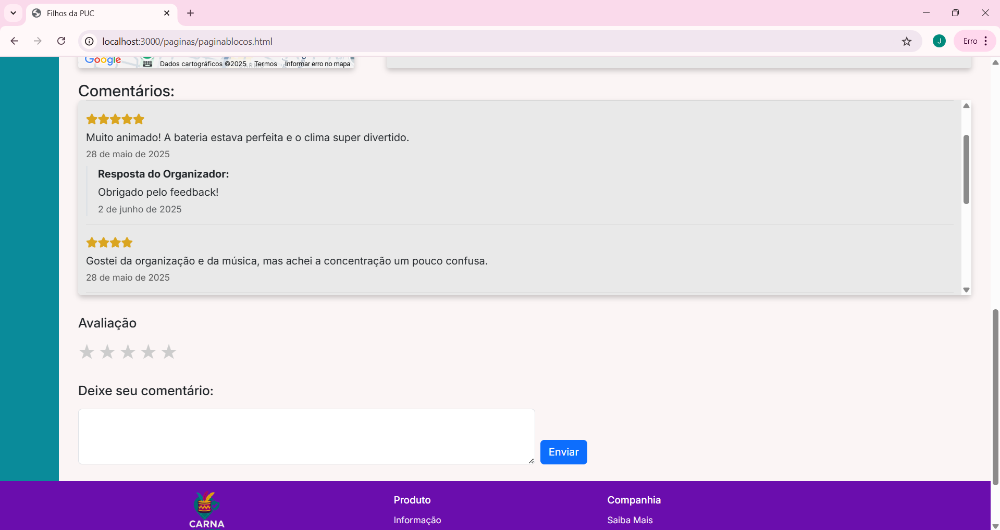

##### Funcionalidade 1 - Cadastro de Contatos ⚠️ EXEMPLO ⚠️

Permite a inclusão, leitura, alteração e exclusão de contatos para o sistema

* **Estrutura de dados:** [Contatos](#ti_ed_contatos)
* **Instruções de acesso:**
  * Abra o site e efetue o login
  * Acesse o menu principal e escolha a opção Cadastros
  * Em seguida, escolha a opção Contatos
* **Tela da funcionalidade**:

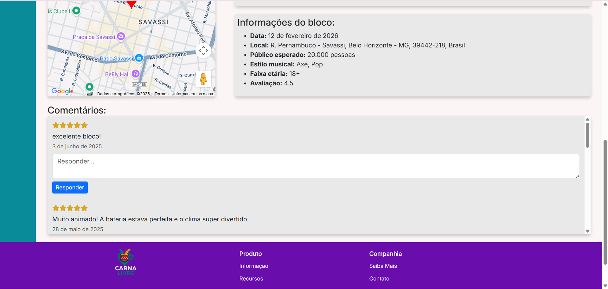

##### Funcionalidade 1 - Cadastro de Contatos ⚠️ EXEMPLO ⚠️

Permite a inclusão, leitura, alteração e exclusão de contatos para o sistema

* **Estrutura de dados:** [Contatos](#ti_ed_contatos)
* **Instruções de acesso:**
  * Abra o site e efetue o login
  * Acesse o menu principal e escolha a opção Cadastros
  * Em seguida, escolha a opção Contatos
* **Tela da funcionalidade**:

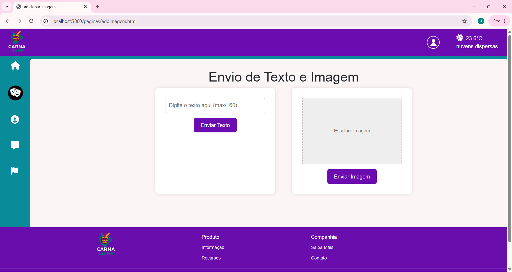

##### Funcionalidade 1 - Cadastro de Contatos ⚠️ EXEMPLO ⚠️

Permite a inclusão, leitura, alteração e exclusão de contatos para o sistema

* **Estrutura de dados:** [Contatos](#ti_ed_contatos)
* **Instruções de acesso:**
  * Abra o site e efetue o login
  * Acesse o menu principal e escolha a opção Cadastros
  * Em seguida, escolha a opção Contatos
* **Tela da funcionalidade**:

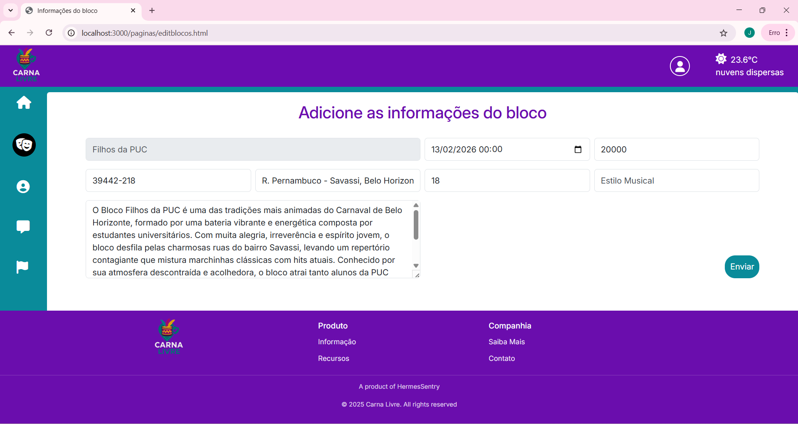

##### Funcionalidade 1 - Cadastro de Contatos ⚠️ EXEMPLO ⚠️

Permite a inclusão, leitura, alteração e exclusão de contatos para o sistema

* **Estrutura de dados:** [Contatos](#ti_ed_contatos)
* **Instruções de acesso:**
  * Abra o site e efetue o login
  * Acesse o menu principal e escolha a opção Cadastros
  * Em seguida, escolha a opção Contatos
* **Tela da funcionalidade**:


##### Funcionalidade 1 - Cadastro de Contatos ⚠️ EXEMPLO ⚠️

Permite a inclusão, leitura, alteração e exclusão de contatos para o sistema

* **Estrutura de dados:** [Contatos](#ti_ed_contatos)
* **Instruções de acesso:**
  * Abra o site e efetue o login
  * Acesse o menu principal e escolha a opção Cadastros
  * Em seguida, escolha a opção Contatos
* **Tela da funcionalidade**:


> ⚠️ **APAGUE ESSA PARTE ANTES DE ENTREGAR SEU TRABALHO**
>
> Apresente cada uma das funcionalidades que a aplicação fornece tanto para os usuários quanto aos administradores da solução.
>
> Inclua, para cada funcionalidade, itens como: (1) titulos e descrição da funcionalidade; (2) Estrutura de dados associada; (3) o detalhe sobre as instruções de acesso e uso.

## Estruturas de Dados

Todas as estruturas descritas estão juntas no mesmo arquivo db.json. Estão funcionando como API Restful por meio do JSON-Server

##### Estrutura de Dados - Blocos de Carnaval   

Cadastro de blocos de carnaval, com um único organizador atrelado a cada bloco, além de um objeto para imagens e descrição para cards.

```json
  {
      "id": 1,
      "nome_bloco": "Filhos da PUC",
      "descricao_geral": "O Bloco Filhos da PUC é composto por uma bateria vibrante formada por estudantes universitários. Com muita alegria e irreverência, o bloco desfila pelas ruas da Savassi. fwokenfoiw  kjweg nfoiwengoiwq fiownqifnwo3ir rw3jfnwiqnfqoin3qkw fokweno",
      "avaliacao": 4.5,
      "data": "2026-02-13",
      "publico": 20000,
      "cep": "39442-218",
      "endereco": "R. Pernambuco - Savassi, Belo Horizonte - MG, 39442-218, Brasil",
      "faixa_etaria": "18+",
      "lat": -19.9350252,
      "lng": -43.9346582,
      "estilo_musical": "Axé, Pop",
      "organizador": [
        {
          "nome_org": "João P. Andrade",
          "email_org": "joao@filhosdapuc.com",
          "cnpj": "12.345.678/0001-00",
          "senha": "senha123"
        }
      ],
      "postagem": [
        {
          "descricao_card": "Samba no pé, tradição e muita energia no coração da Savassi.",
          "imagens": [
            {
              "id": 1,
              "src": "../assets/img/blocoexemplo.jpg"
            },
            {
              "id": 2,
              "src": "../assets/img/blocoexemplo.jpg"
            },
            {
              "id": 3,
              "src": "../assets/img/blocoexemplo.jpg"
            },
            {
              "id": 4,
              "src": "../assets/img/blocoexemplo.jpg"
            }
          ]
        }
      ]
    },
  
```

##### Estrutura de Dados - Usuários Foliões

Registro dos usuários do sistema utilizados para login e para o perfil do sistema.

```json
  {
      "id": 2,
      "nome_completo": "João Campos",
      "login": "joaoo",
      "email": "joaoao@gmail.com",
      "data_nasc": "2002-02-12",
      "senha": "12345",
      "chat": {
        "contacts": [],
        "groups": [],
        "messages": {}
      }
 },
```

##### Estrutura de Dados - Denúncias

Cadastro de denúncias com descrição e localização para exibição em mapa interativo.

```json
  {
      "id": 1,
      "horario": "16:30",
      "bloco": "Filhos da PUC",
      "local": "R. Pernambuco - Savassi, Belo Horizonte - MG, 39442-218, Brasil",
      "lat": -19.9350252,
      "lng": -43.9346582,
      "ocorrido": "assalto"
    },
```

##### Estrutura de Dados - Comentários

Cadastro de comentários atrelados a cada página de blocos, com objeto para armazenar a resposta do organizador bloco.

```json
  {
      "id": 1,
      "blocoId": 1,
      "usuarioId": 1,
      "texto": "Muito animado! A bateria estava perfeita e o clima super divertido.",
      "avaliacao": 5,
      "data": "2025-05-28T15:30:00",
      "resposta": {
        "texto": "Obrigado pelo feedback!",
        "data": "2025-06-02T21:40:56.072Z",
        "organizadorId": "99"
      }
 },
```

## Módulos e APIs

Esta seção apresenta os módulos e APIs utilizados na solução

**Estrutura de Dados**:

* NPM/JSON-Server - [https://www.npmjs.com/package/json-server](https://www.npmjs.com/package/json-server)

**Mapa**:

* Google Maps/Place API - [https://developers.google.com/maps/apis-by-platform?hl=pt-br](https://developers.google.com/maps/apis-by-platform?hl=pt-br)

**Clima**:

* Open Weather - [https://openweathermap.org/api](https://openweathermap.org/api)

**Fonts:**

* Icons Font Face - [https://fontawesome.com/](https://fontawesome.com/)
* Google Fonts - [https://fonts.google.com/](https://fonts.google.com/)

**Scripts:**

* jQuery - [http://www.jquery.com/](http://www.jquery.com/) 
* Bootstrap 4 - [http://getbootstrap.com/](http://getbootstrap.com/) 

# Referências

As referências utilizadas no trabalho foram:

* SOBRENOME, Nome do autor. Título da obra. 8. ed. Cidade: Editora, 2000. 287 p ⚠️ EXEMPLO ⚠️

> ⚠️ **APAGUE ESSA PARTE ANTES DE ENTREGAR SEU TRABALHO**
>
> Inclua todas as referências (livros, artigos, sites, etc) utilizados no desenvolvimento do trabalho.
>
> **Orientações**:
>
> - [Formato ABNT](https://www.normastecnicas.com/abnt/trabalhos-academicos/referencias/)
> - [Referências Bibliográficas da ABNT](https://comunidade.rockcontent.com/referencia-bibliografica-abnt/)
